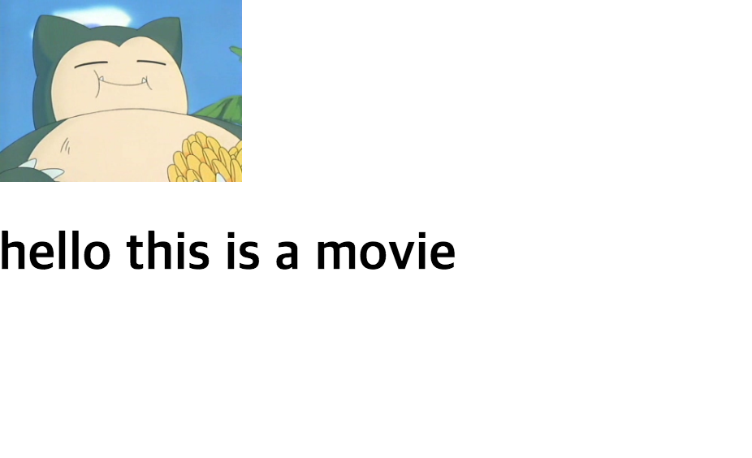

# 강의 내용 정리

## 필수 설치 내역
1. npm
2. node
3. yarn
4. npm install -g create-react-app


## 시작하기
### # Ch1 Hello World with React and CRA

#### react 앱 생성 
> $ create-react-app 앱이름 

#### react 앱 start ( runserver )
> $ cd 앱이름  
> $ yarn start

- yarn start 명령을 통해 react-script 를 실행 시킨다.
- http://localhost:3000의 리액트 기본 페이지를 브라우저를 통해 확인 할 수 있다
- CRA ( create-react-app )을 사용하는 가장 큰 이유는 기타 세세한 configuration을 직접 하지 않아도 된다는 장점 때문이다.

#### yarn
- yarn을 이용해 react 앱을 실행시(runserver) 소스코드를 변경 하는 순간 yarn이 컴파일을 시작하고 수정된 내용을 반영하여 서버에 빌드 한다.

```
[ 참고 ] git tag 추가하기

tag 푸쉬하기

git push 원격저장소명 태그명
git push 원격저장소명 로컬브랜치명 --tags

원격저장소에 특정태그를 푸쉬하려면 첫번째 명령어를 사용하면 되고 로컬브랜치의 모든 태그를(태그는 브랜치에 종속적이므로) 푸쉬하려면 두번째 명령어를 사용하면 됩니다.

➜  movie_app git:(master) git tag ch1_end
➜  movie_app git:(master) git push origin master --tags
```

## 컴포넌트와 Props
### # Ch2 Creating React Components with JSX

> yarn start 를 하게 되면 JS의 모든 코드를 가져와 html 파일에 담는다.

> 위 과정을 통해 생성된 파일은 public 디렉토리에 생성 된다.

#### - 컴포넌트 기본 구성형태

> 모든 컴포넌트는 렌더 하고 리턴 해야 한다!!!  
> = 컴포넌트 > render > return > JSX

```
// 1. React, Component 임포트
import React, { Component } from 'react';

// 2. Movie.js 에 해당하는 css 임포트
import './Movie.css';

// 3-1. Movie 클래스에 컴포넌트를 상속 받아 컴포넌트 생성
class Movie extends Component{
    // 3-2. 렌더
    render(){
        // 3-3. 리턴
        return(
            // 3-4. html / JSX 코드
            <h1>hello this is a movie</h1>
        )
    }
}

// 4. export 를 통한 컴포넌트 반환
export default Movie;
```


#### - 리액트의 컴포넌트 배치

> 큰 컴포넌트 안에 작은 컴포넌트를 집어넣는 방식으로 작업한다.

```
import React, { Component } from 'react';
import './Movie.css';

class Movie extends Component{
    render(){
        return(
            <div>
                // 하위 컴포넌트 호출
                <MoviePoster/>
                <h1>hello this is a movie</h1>
            </div>
        )
    }
}

// 하위 컴포넌트 생성
class MoviePoster extends Component {
    render(){
        return (
            
        )
    }
}

export default Movie;
```

