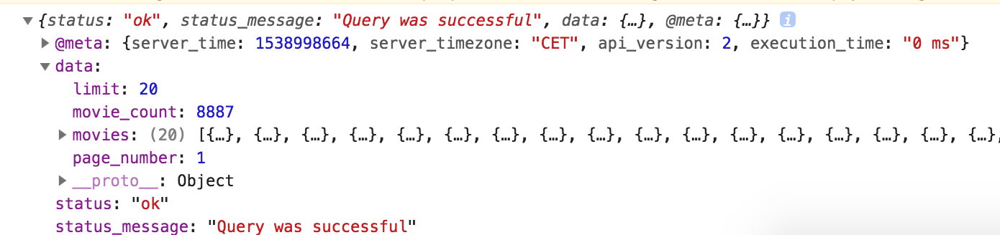

# # Ch6 AJAX
## 6-1 Ajax in React

### Fetch

> fetch 란? 특정 URL의 네트워크 요청을 쉽게 활용할 수 있도록 해주는 함수

```
fetch('https://yts.ag/api/v2/list_movies.json?sort_by=rating')
```

## 6-2 Promise

### Promise

#### .then( source )

> 앞 라인의 로직이 수행 된 후 source를 수행 하도록 한다.

#### .catch( source )

> 앞 라인의 로직 수행 중 에러 발생시 source를 수행 하도록 한다.

```
componentDidMount(){
    fetch('https://yts.ag/api/v2/list_movies.json?sort_by=rating')
    .then(response => console.log(response))
    .catch(err => console.log(err))
  }
```

- fetch(url) 의 통신이 완료 되면, 통신 결과를 response에 담아 console.log로 출력 하고,  
오류 발생 시 오류 내용을 console.log로 출력 하라.


> .json() : 해당 데이터를 json형식의 데이터로 변환 한다.

```
fetch('https://yts.ag/api/v2/list_movies.json?sort_by=rating')
    .then(response => response.json())
    .then(json => console.log(json))
    .catch(err => console.log(err))
```

- .then(response => response.json())  
: 앞 로직(fetch)이 수행 된 후 fetch의 결과물을 response변수에 담은 후 json형태로 변환 한다.

- .then(json => console.log(json))  
: 변환 되어 반환 한 후 해당 값을 json 변수에 담은 후 console.log로 출력 한다.  

- .catch(err => console.log(err))  
: 앞의 작업 중 오류 발생시 해당 오류를 console.log로 출력 한다.



